Vector Autoregressive (VAR)
================
2024-03-18

#### Libraries

``` r
library(vars)
library(tsDyn)
library(tseries)
library(stargazer)
```

#### Simalating bivariate VAR(2)

``` r
set.seed(111)
A1 <- matrix(c(0.5, 0.4, 0.1, 0.5), 2)
A2 <- matrix(c(0, 0.25, 0, 0), 2)
B <- cbind(A1, A2)
var <- VAR.sim(B = B, n = 250, include = "none", lag = 2)
var_ts <- data.frame(y1_t = var[, 1], y2_t = var[, 2])
plot.ts(var_ts)
```

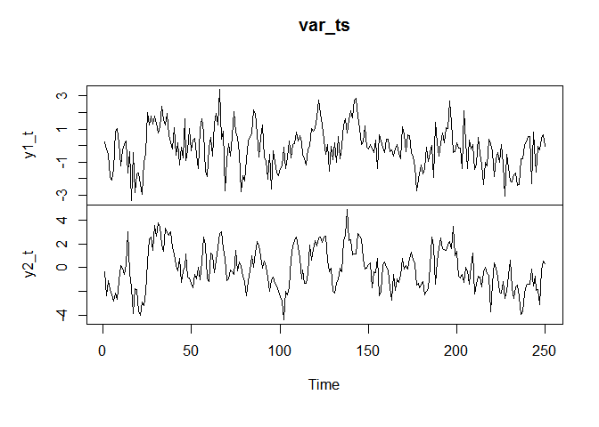<!-- --> \#### Checking
stationarity of series

``` r
adf.test(var_ts$y1_t)
```

    ## 
    ##  Augmented Dickey-Fuller Test
    ## 
    ## data:  var_ts$y1_t
    ## Dickey-Fuller = -5.1134, Lag order = 6, p-value = 0.01
    ## alternative hypothesis: stationary

``` r
adf.test(var_ts$y2_t)
```

    ## 
    ##  Augmented Dickey-Fuller Test
    ## 
    ## data:  var_ts$y2_t
    ## Dickey-Fuller = -5.0725, Lag order = 6, p-value = 0.01
    ## alternative hypothesis: stationary

#### fitting a VAR model to simalated data

``` r
lag <- VARselect(var_ts, lag.max = 5)
lag
```

    ## $selection
    ## AIC(n)  HQ(n)  SC(n) FPE(n) 
    ##      1      1      1      1 
    ## 
    ## $criteria
    ##                 1          2          3          4          5
    ## AIC(n) 0.03949038 0.04362059 0.07107439 0.09433424 0.09919465
    ## HQ(n)  0.07401986 0.10116972 0.15164317 0.19792267 0.22580274
    ## SC(n)  0.12523548 0.18652909 0.27114629 0.35156954 0.41359335
    ## FPE(n) 1.04028304 1.04459779 1.07369450 1.09899969 1.10441466

``` r
model <- VAR(var_ts, p = 2, type = "non")
stargazer(model$varresult, type = "text", style = "aer", title = "VAR(2)", columns.label = c("y1_t", "y2_t"))
```

    ## 
    ## VAR(2)
    ## ======================================================================
    ##                                                   y                   
    ##                                        (1)                 (2)        
    ## ----------------------------------------------------------------------
    ## y1_t.l1                             0.401***            0.550***      
    ##                                      (0.064)             (0.061)      
    ##                                                                       
    ## y2_t.l1                               0.107             0.546***      
    ##                                      (0.066)             (0.063)      
    ##                                                                       
    ## y1_t.l2                               0.122               0.112       
    ##                                      (0.075)             (0.071)      
    ##                                                                       
    ## y2_t.l2                               0.010              -0.062       
    ##                                      (0.056)             (0.054)      
    ##                                                                       
    ## Observations                           248                 248        
    ## R2                                    0.348               0.697       
    ## Adjusted R2                           0.337               0.693       
    ## Residual Std. Error (df = 244)        1.023               0.976       
    ## F Statistic (df = 4; 244)           32.535***          140.652***     
    ## ----------------------------------------------------------------------
    ## Notes:                         ***Significant at the 1 percent level. 
    ##                                **Significant at the 5 percent level.  
    ##                                *Significant at the 10 percent level.  
    ## 
    ## VAR(2)
    ## =========
    ## y1_t y2_t
    ## ---------

#### Checking the stability

``` r
roots(model, modulus = TRUE)
```

    ## [1] 0.8009085 0.2315446 0.2315446 0.2025505

#### CUMSUM test and serial correlation

``` r
stability_model <- stability(model)
plot(stability_model$stability$y1_t, lwd = 2)
```

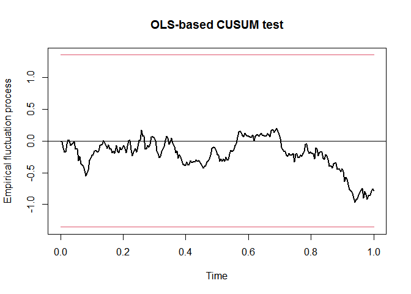<!-- -->

``` r
plot(stability_model$stability$y2_t, lwd = 2)
```

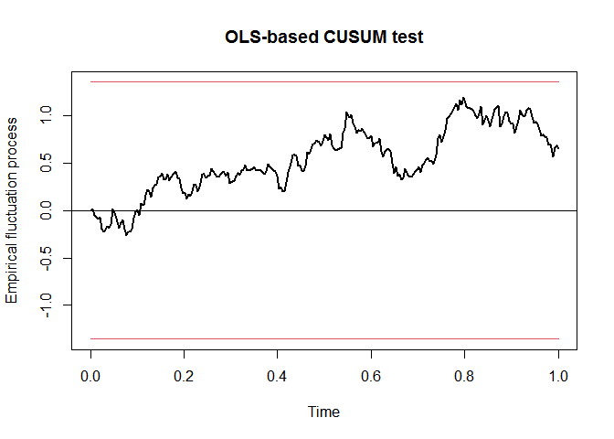<!-- -->

``` r
sctest(model)
```

    ## 
    ##  M-fluctuation test
    ## 
    ## data:  model
    ## f(efp) = 1.103, p-value = 0.7863

``` r
serial <- serial.test(model, lags.pt = 8)
plot(serial, names = "y1_t")
```

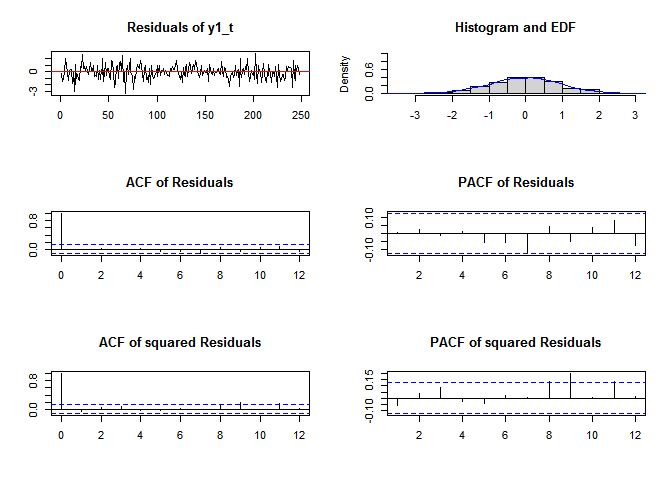<!-- -->

``` r
plot(serial, names = "y2_t")
```

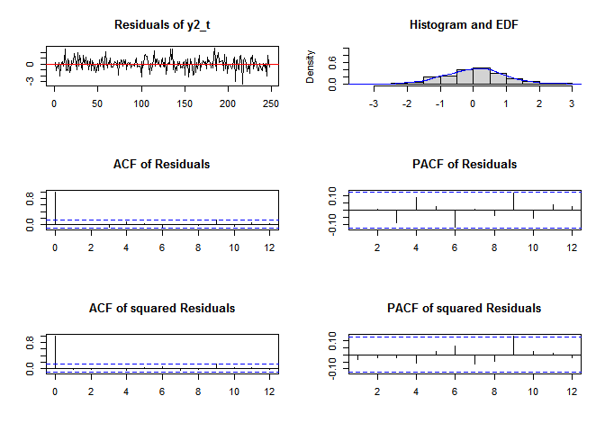<!-- -->

#### Test for heteroscedasticity

``` r
arch.test(model, lags.multi = 12, multivariate.only = TRUE)
```

    ## 
    ##  ARCH (multivariate)
    ## 
    ## data:  Residuals of VAR object model
    ## Chi-squared = 128.34, df = 108, p-value = 0.0885

##### The p-value above 0.05 suggests homoscedasticity, or constant variance.

#### Normality test

``` r
normality.test(model, multivariate.only = TRUE)
```

    ## $JB
    ## 
    ##  JB-Test (multivariate)
    ## 
    ## data:  Residuals of VAR object model
    ## Chi-squared = 7.3074, df = 4, p-value = 0.1205
    ## 
    ## 
    ## $Skewness
    ## 
    ##  Skewness only (multivariate)
    ## 
    ## data:  Residuals of VAR object model
    ## Chi-squared = 1.6081, df = 2, p-value = 0.4475
    ## 
    ## 
    ## $Kurtosis
    ## 
    ##  Kurtosis only (multivariate)
    ## 
    ## data:  Residuals of VAR object model
    ## Chi-squared = 5.6993, df = 2, p-value = 0.05786

##### The p-value suggests that the normality assumption for the residuals is met.

#### Granger and instantanius causality

``` r
granger_y1 <- causality(model, cause = "y1_t")
granger_y2 <- causality(model, cause = "y2_t")

granger_y1
```

    ## $Granger
    ## 
    ##  Granger causality H0: y1_t do not Granger-cause y2_t
    ## 
    ## data:  VAR object model
    ## F-Test = 52.646, df1 = 2, df2 = 488, p-value < 2.2e-16
    ## 
    ## 
    ## $Instant
    ## 
    ##  H0: No instantaneous causality between: y1_t and y2_t
    ## 
    ## data:  VAR object model
    ## Chi-squared = 1.0672, df = 1, p-value = 0.3016

``` r
granger_y2
```

    ## $Granger
    ## 
    ##  Granger causality H0: y2_t do not Granger-cause y1_t
    ## 
    ## data:  VAR object model
    ## F-Test = 2.4712, df1 = 2, df2 = 488, p-value = 0.08554
    ## 
    ## 
    ## $Instant
    ## 
    ##  H0: No instantaneous causality between: y2_t and y1_t
    ## 
    ## data:  VAR object model
    ## Chi-squared = 1.0672, df = 1, p-value = 0.3016

#### Impuse Responce

``` r
irf11 <- irf(model, impulse = "y1_t", response = "y1_t", n.ahead = 40, 
boot = TRUE, run = 100, ci = 0.95)
plot(irf11)
```

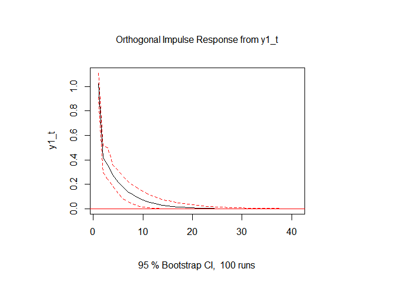<!-- -->

``` r
irf12 <- irf(model, impulse = "y1_t", response = "y2_t", n.ahead = 40, 
boot = TRUE, run = 100, ci = 0.95)
plot(irf12)
```

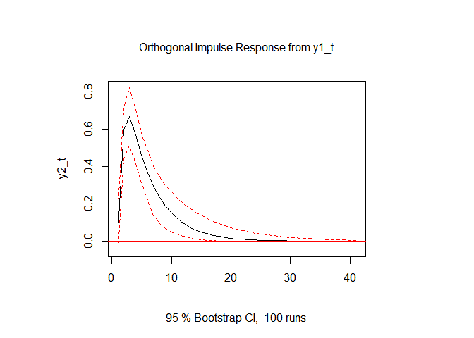<!-- -->

``` r
irf22 <- irf(model, impulse = "y2_t", response = "y2_t", n.ahead = 40, 
boot = TRUE, run = 100, ci = 0.95)
plot(irf22)
```

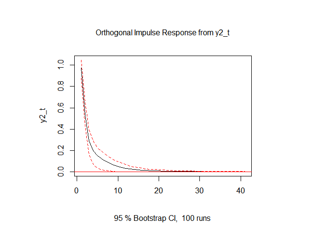<!-- -->

``` r
irf21 <- irf(model, impulse = "y2_t", response = "y1_t", n.ahead = 40, 
boot = TRUE, run = 100, ci = 0.95)
plot(irf21)
```

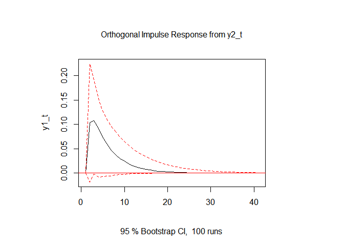<!-- -->

##### Here we note that a positive shock to y1_t increases y2_t by a relatively large and persistent amount.

#### Forecast Error Variance decomposition (FEVD)

``` r
vd <- fevd(model, n.ahead = 15)
plot(vd)
```

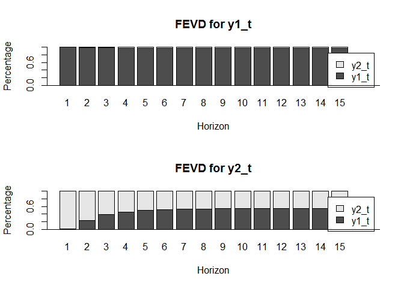<!-- -->

#### Forecast

``` r
pred <- predict(model, n.ahead = 20)
plot(pred, names = "y1_t")
```

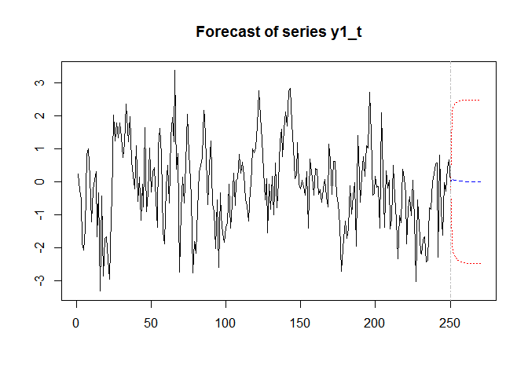<!-- -->

``` r
plot(pred, names = "y2_t")
```

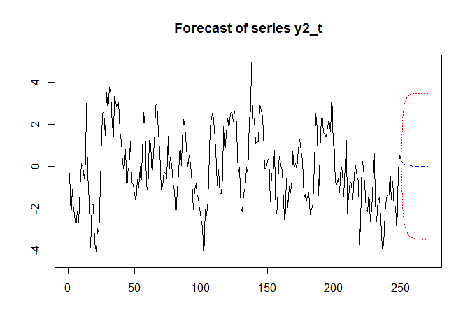<!-- -->

``` r
fanchart(pred, names = "y1_t", color = c("skyblue4", "skyblue3", "skyblue2", "skyblue1", 
"skyblue", "purple4", "purple3", "purple2", "purple1", col.y = "skyblue"))
```

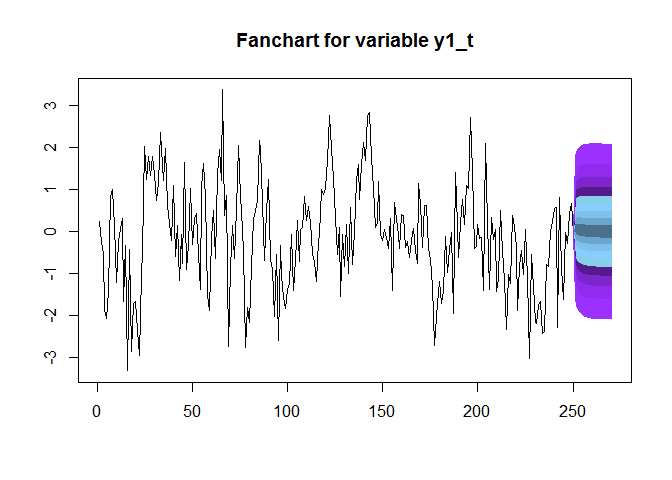<!-- -->

``` r
fanchart(pred, names = "y2_t", color = c("skyblue4", "skyblue3", "skyblue2", "skyblue1", 
"skyblue", "purple4", "purple3", "purple2", "purple1", col.y = "skyblue"))
```

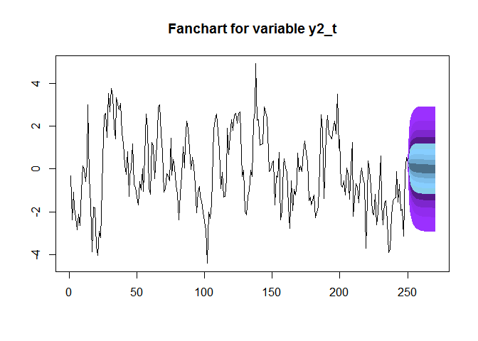<!-- -->
